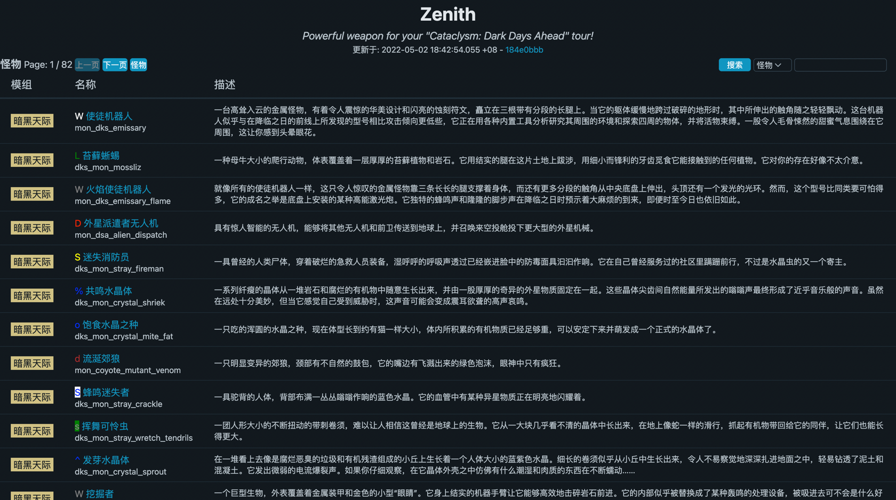
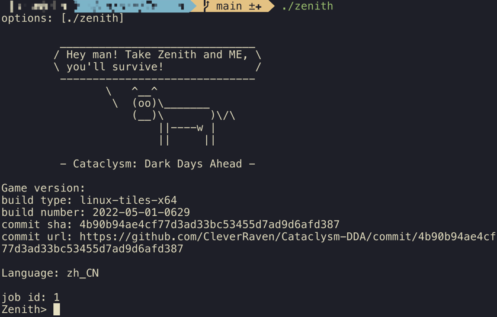
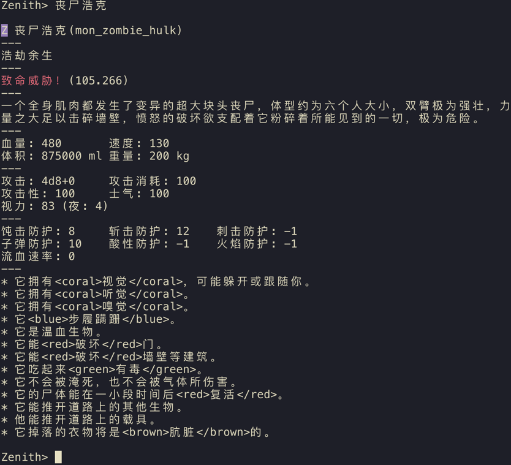

# Zenith
Powerful weapon for your ["Cataclysm: Dark Days Ahead"](https://github.com/CleverRaven/Cataclysm-DDA) tour!
```
 ______________________________ 
/ 嘿哥们！只有带上Zenith和我，     \
\ 你才有条生路！                  /
 ------------------------------ 
        \   ^__^
         \  (oo)\_______
            (__)\       )\/\
                ||----w |
                ||     ||
```
> "Zenith"这个命名取自于 [Terraria](https://terraria.org) 中最厉害的战士武器天顶剑 [](https://terraria.fandom.com/wiki/Zenith) 。

### Zenith是什么?
Zenith是一个能够帮你更好地在 Cataclysm: Dark Days Ahead 这个游戏中生存下去的工具。它通过解析和处理游戏的数据并建立索引供我们搜索出一些游戏中没有提供的隐藏数据，比如，🧟‍♂的血量，速度，攻击等。        
目前该项目还是一个非常初期的阶段，未来还打算实现诸如配方之类的数据索引。   
由于个人很难有大片时间来开发，所以新特性的进度可能非常缓慢，非常欢迎任何形式的PR！

### 怎么使用?
目前提供了命令行和网页两个版本（由于命令行不好排版、UI难画，后续估计弃坑了

#### 网页版
##### 私有化部署
```bash
bash run.sh
```
会启动一个nginx和一个go web两个容器（是的，目前只是单机部署   
肯定会报错的，根据错误把缺失的东西补上就好（比如你自己的https证书）

##### 在线网页
https://cdda.ngtrio.me/   
目前只初步支持怪物数据的检索



#### 命令行版
##### 编译并执行
```bash
go build -o zenith cmd/zenith/main.go
./zenith [options]
```
> 目前options有下列几个可选项:
> 1. --help 显示options
> 2. --update-now 强制更新游戏数据到最新
> 3. --lang:xxx 选择工具的语言，如果不设置默认是中文
> 4. --use-proxy 通过代理加速游戏数据的下载，感谢 [GitHub Proxy](https://ghproxy.com/)
> 5. --debug-mode 调试模式，会打debug日志
> 6. --disable-banner 在启动时关闭上面那个~~欠揍的~~Ascii画

##### 启动

##### 搜索  
搜索怪物名字或者id即可（命令行版本目前没支持模糊搜索）

（上面的颜色标签是在i18n文件中引入的，目前命令行还没做颜色转换。英文不会有这些标签)   
##### 退出   
输入`quit` 或者 `exit`！