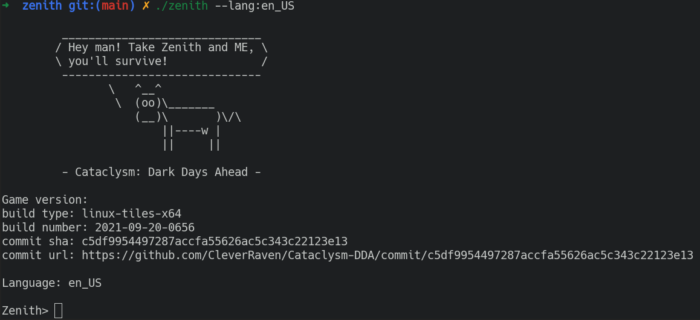
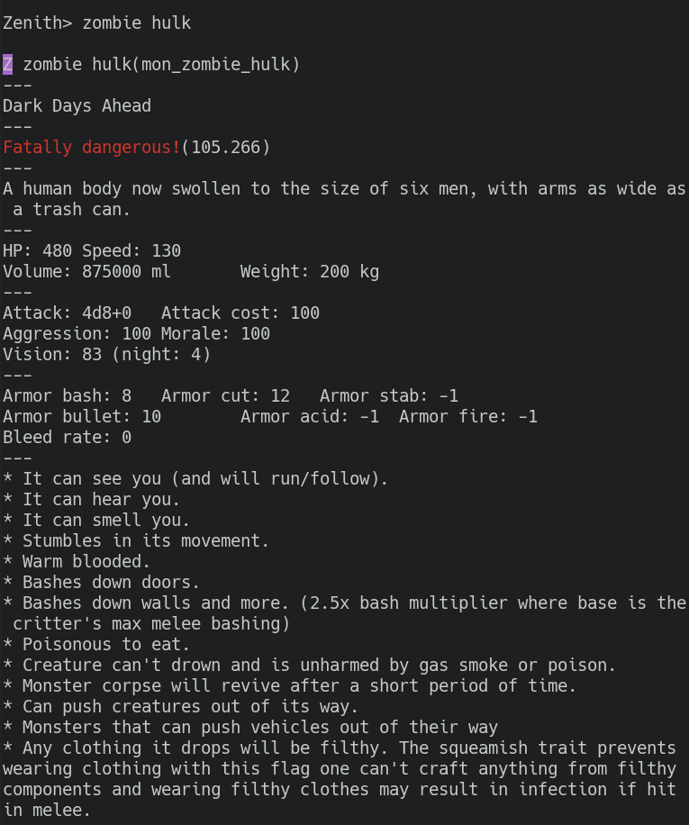

# Zenith
Powerful weapon for your ["Cataclysm: Dark Days Ahead"](https://github.com/CleverRaven/Cataclysm-DDA) tour!
```
 ______________________________ 
/ Hey man! Take Zenith and ME, \
\ you'll survive!              /
 ------------------------------ 
        \   ^__^
         \  (oo)\_______
            (__)\       )\/\
                ||----w |
                ||     ||
```
> The name "Zenith" comes from the most powerful sword [](https://terraria.fandom.com/wiki/Zenith) in [Terraria](https://terraria.org).

### What is Zenith?
Zenith is a tool to help you survive better in game Cataclysm: Dark Days Ahead. It parses and processes the json data of the game, and then builds some indexes for you to search for more detailed information than the game provides.  
For example, the monster's HP, speed, attack, etc. More types such as recipes and items will be added in the future. Any contributions are welcome.

### How to use?
1. Compile the source
   ```bash
   go build -o zenith cmd/zenith/main.go
   ```
2. Execute 
   ```bash
   ./zenith [options]
   ``` 
   
   > Currently only the following options are provided:  
   > 1. --help  
   > show usages
   > 2. --update-now  
   > download or update the game data to the latest version
   > 3. --lang:xxx  
   > set the language for zenith, the default is zh_CN if this option is missing.
   > 4. --use-proxy  
   > speed ​​up downloads via proxy (China only), thanks to [GitHub Proxy](https://ghproxy.com/)
   > 5. --debug-mode  
   > execute in debug mode
   > 6. --disable-banner  
   > disable the welcome banner

3. Search  
   Enter the name or id of the thing you want to query.  
   For example, if you want to search `zombie hulk`(the corresponding id is `mon_zombie_hulk`), then your can enter any of them.  
   

4. Quit  
   Just enter `quit` or `exit`!